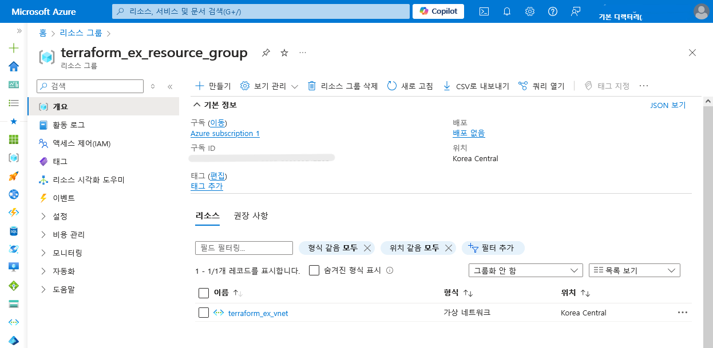

# terraform_ex

## Azure CLI 설치

<https://learn.microsoft.com/ko-kr/cli/azure/install-azure-cli-linux?pivots=apt>

```bash
curl -sL https://aka.ms/InstallAzureCLIDeb | sudo bash
```

## Azure 로그인

```bash
terraform_ex/01.Terraform using ☁️ Azure subscription 1 …
➜ az login
A web browser has been opened at https://login.microsoftonline.com/organizations/oauth2/v2.0/authorize. Please continue the login in the web browser. If no web browser is available or if the web browser fails to open, use device code flow with `az login --use-device-code`.

Retrieving tenants and subscriptions for the selection...

[Tenant and subscription selection]

No     Subscription name     Subscription ID                       Tenant
-----  --------------------  ------------------------------------  -------------
[1] *  Azure subscription 1  xxxxxxxx-xxxx-xxxx-xxxx-xxxxxxxxxxxx  기본 디렉터리

The default is marked with an *; the default tenant is '기본 디렉터리' and subscription is 'Azure subscription 1' (xxxxxxxx-xxxx-xxxx-xxxx-xxxxxxxxxxxx).

Select a subscription and tenant (Type a number or Enter for no changes): 

Tenant: 기본 디렉터리
Subscription: Azure subscription 1 (xxxxxxxx-xxxx-xxxx-xxxx-xxxxxxxxxxxx)

# ...

terraform_ex/01.Terraform using ☁️ Azure subscription 1 …
➜ az account set --subscription "xxxxxxxx-xxxx-xxxx-xxxx-xxxxxxxxxxxx"
```

## Service Principal 생성

Service Principal은 Terraform이 사용자를 대신하여 작업을 수행하는 데 필요한 인증 토큰이 있는 Azure Active Directory 내의 응용 프로그램.

```bash
terraform_ex/01.Terraform using ☁️ Azure subscription 1 …
➜ az ad sp create-for-rbac --role="Contributor" --scopes="/subscriptions/xxxxxxxx-xxxx-xxxx-xxxx-xxxxxxxxxxxx"
Creating 'Contributor' role assignment under scope '/subscriptions/xxxxxxxx-xxxx-xxxx-xxxx-xxxxxxxxxxxx'
The output includes credentials that you must protect. Be sure that you do not include these credentials in your code or check the credentials into your source control. For more information, see https://aka.ms/azadsp-cli
{
  "appId": "xxxxxx-xxx-xxxx-xxxx-xxxxxxxxxx",
  "displayName": "azure-cli-2024-xxxx",
  "password": "xxxxxx~xxxxxx~xxxxx",
  "tenant": "xxxxx-xxxx-xxxxx-xxxx-xxxxx"
}
```

## 환경 변수 설정

```bash
terraform_ex/01.Terraform using ☁️ Azure subscription 1 …
➜ cp .env.template .env

terraform_ex/01.Terraform using ☁️ Azure subscription 1 …
➜ vi .env
ARM_CLIENT_ID="<APPID_VALUE>"
ARM_CLIENT_SECRET="<PASSWORD_VALUE>"
ARM_SUBSCRIPTION_ID="<SUBSCRIPTION_ID>"
ARM_TENANT_ID="<TENANT_VALUE>"

terraform_ex/01.Terraform using ☁️ Azure subscription 1 …
➜ set -a; source .env; set +a
```

## tf 파일 작성

[tf 파일](./main.tf)

```terraform
terraform {
  required_providers {
    azurerm = {
      source  = "hashicorp/azurerm"
      version = "~> 3.116.0"
    }
  }

  required_version = ">= 1.1.0"
}

provider "azurerm" {
  features {}
}

resource "azurerm_resource_group" "rg" {
  name     = "terraform_ex_resource_group"
  location = "koreacentral"
}

```

- `terraform{}` 블록은 Terraform 설정을 위한 블록.
  - Terraform이 인프라 프로비저닝을 할 때 사용할 provider 포함.
  - 각 provider에서 `source` 속성으로 호스트명, 네임스페이스, 프로바이더 유형 등을 선언할 수 있음.
  - `version` 속성으로 버전을 명시하지 않으면 최신 버전으로 다운로드함.
- `provider` 블록에서 프로바이더 설정.
  - 여기서는 `azurerm` 프로바이더 사용 ([참고](https://registry.terraform.io/providers/hashicorp/azurerm/latest/docs))
  - 리소스를 생성하고 관리하는 데 사용됨.
  - 다른 프로바이더의 리소스를 관리하기 위해 여러 개의 `provider` 블록을 정의할 수 있음.
- `resource` 블록에서 인프라 정의.
  - 블록 시작 부분에 리소스 유형, 이름 정보가 있어야 함. 위 예시에서는 `azurerm_resource_group`이 유형, `rg`가 이름.

## Terraform 설정 초기화

```bash
terraform_ex/01.Terraform using ☁️ Azure subscription 1 …
➜ terraform init         
Initializing the backend...
Initializing provider plugins...
- Finding hashicorp/azurerm versions matching "~> 3.116.0"...
- Installing hashicorp/azurerm v3.116.0...
- Installed hashicorp/azurerm v3.116.0 (signed by HashiCorp)
Terraform has created a lock file .terraform.lock.hcl to record the provider
selections it made above. Include this file in your version control repository
so that Terraform can guarantee to make the same selections by default when
you run "terraform init" in the future.

Terraform has been successfully initialized!

You may now begin working with Terraform. Try running "terraform plan" to see
any changes that are required for your infrastructure. All Terraform commands
should now work.

If you ever set or change modules or backend configuration for Terraform,
rerun this command to reinitialize your working directory. If you forget, other
commands will detect it and remind you to do so if necessary.
```

## Terraform 설정 적용

```bash
terraform_ex/01.Terraform using ☁️ Azure subscription 1 …
➜ terraform apply   

Terraform used the selected providers to generate the following execution plan. Resource actions are indicated with the following symbols:
  + create

Terraform will perform the following actions:

  # azurerm_resource_group.rg will be created
  + resource "azurerm_resource_group" "rg" {
      + id       = (known after apply)
      + location = "koreacentral"
      + name     = "terraform_ex_resource_group"
    }

Plan: 1 to add, 0 to change, 0 to destroy.

Do you want to perform these actions?
  Terraform will perform the actions described above.
  Only 'yes' will be accepted to approve.

  Enter a value: yes

azurerm_resource_group.rg: Creating...
azurerm_resource_group.rg: Creation complete after 8s [id=/subscriptions/xxxxxxxx-xxxx-xxxx-xxxx-xxxxxxxxxxxx/resourceGroups/terraform_ex_resource_group]

Apply complete! Resources: 1 added, 0 changed, 0 destroyed.
```

- Azure 포털에서 리소스 그룹 생성 확인

  

## 현재 상태 확인

- apply를 하면 `terraform.tfstate` 파일에 Terraform이 생성한 리소스의 아이디와 프로퍼티를 기록.
  - ***이 파일에는 중요 정보도 포함되므로 공유하거나 깃허브에 올리면 안됨.***
- 현재 상태 보는 방법

  ```bash
  terraform_ex/01.Terraform using ☁️ Azure subscription 1 …
  ➜ terraform show 
  # azurerm_resource_group.rg:
  resource "azurerm_resource_group" "rg" {
      id         = "/subscriptions/xxxxxxxx-xxxx-xxxx-xxxx-xxxxxxxxxxxx/resourceGroups/terraform_ex_resource_group"
      location   = "koreacentral"
      managed_by = null
      name       = "terraform_ex_resource_group"
  }

  terraform_ex/01.Terraform using ☁️ Azure subscription 1 …
  ➜ terraform state list
  azurerm_resource_group.rg
  ```

## 새 리소스 추가

```terraform
# main.tf

...

resource "azurerm_virtual_network" "vnet" {
  name = "terraform_ex_vnet"
  address_space = [ "10.0.0.0/16" ]
  location = "koreacentral"
  resource_group_name = azurerm_resource_group.rg.name
}
```

```bash
terraform_ex/01.Terraform using ☁️ Azure subscription 1 …
➜ terraform apply     
azurerm_resource_group.rg: Refreshing state... [id=/subscriptions/xxxxxxxx-xxxx-xxxx-xxxx-xxxxxxxxxxxx/resourceGroups/terraform_ex_resource_group]

Terraform used the selected providers to generate the following execution plan. Resource actions are indicated with the following symbols:
  + create

Terraform will perform the following actions:

  # azurerm_virtual_network.vnet will be created
  + resource "azurerm_virtual_network" "vnet" {
      + address_space       = [
          + "10.0.0.0/16",
        ]
      + dns_servers         = (known after apply)
      + guid                = (known after apply)
      + id                  = (known after apply)
      + location            = "koreacentral"
      + name                = "terraform_ex_vnet"
      + resource_group_name = "terraform_ex_resource_group"
      + subnet              = (known after apply)
    }

Plan: 1 to add, 0 to change, 0 to destroy.

Do you want to perform these actions?
  Terraform will perform the actions described above.
  Only 'yes' will be accepted to approve.

  Enter a value: yes

azurerm_virtual_network.vnet: Creating...
azurerm_virtual_network.vnet: Creation complete after 4s [id=/subscriptions/xxxxxxxx-xxxx-xxxx-xxxx-xxxxxxxxxxxx/resourceGroups/terraform_ex_resource_group/providers/Microsoft.Network/virtualNetworks/terraform_ex_vnet]

Apply complete! Resources: 1 added, 0 changed, 0 destroyed.
```

- Azure 포털에서 리소스 그룹 생성 확인

  

- CLI로 확인

  ```bash
  terraform_ex/01.Terraform using ☁️ Azure subscription 1 …
  ➜ terraform show      
  # azurerm_resource_group.rg:
  resource "azurerm_resource_group" "rg" {
      id         = "/subscriptions/xxxxxxxx-xxxx-xxxx-xxxx-xxxxxxxxxxxx/resourceGroups/terraform_ex_resource_group"
      location   = "koreacentral"
      managed_by = null
      name       = "terraform_ex_resource_group"
      tags       = {}
  }

  # azurerm_virtual_network.vnet:
  resource "azurerm_virtual_network" "vnet" {
      address_space           = [
          "10.0.0.0/16",
      ]
      bgp_community           = null
      dns_servers             = []
      edge_zone               = null
      flow_timeout_in_minutes = 0
      guid                    = "xxxxxxxx-xxxx-xxxx-xxxx-xxxxxxxxxxxx"
      id                      = "/subscriptions/xxxxxxxx-xxxx-xxxx-xxxx-xxxxxxxxxxxx/resourceGroups/terraform_ex_resource_group/providers/Microsoft.Network/virtualNetworks/terraform_ex_vnet"
      location                = "koreacentral"
      name                    = "terraform_ex_vnet"
      resource_group_name     = "terraform_ex_resource_group"
      subnet                  = []
  }

  terraform_ex/01.Terraform using ☁️ Azure subscription 1 …
  ➜ terraform state list
  azurerm_resource_group.rg
  azurerm_virtual_network.vnet
  ```

## 리소스 제거

```bash
terraform_ex/01.Terraform using ☁️ Azure subscription 1 …
➜ terraform destroy   
azurerm_resource_group.rg: Refreshing state... [id=/subscriptions/xxxxxxxx-xxxx-xxxx-xxxx-xxxxxxxxxxxx/resourceGroups/terraform_ex_resource_group]
azurerm_virtual_network.vnet: Refreshing state... [id=/subscriptions/xxxxxxxx-xxxx-xxxx-xxxx-xxxxxxxxxxxx/resourceGroups/terraform_ex_resource_group/providers/Microsoft.Network/virtualNetworks/terraform_ex_vnet]

Terraform used the selected providers to generate the following execution plan. Resource actions are indicated with the following symbols:
  - destroy

Terraform will perform the following actions:

  # azurerm_resource_group.rg will be destroyed
  - resource "azurerm_resource_group" "rg" {
      - id         = "/subscriptions/xxxxxxxx-xxxx-xxxx-xxxx-xxxxxxxxxxxx/resourceGroups/terraform_ex_resource_group" -> null
      - location   = "koreacentral" -> null
      - name       = "terraform_ex_resource_group" -> null
      - tags       = {} -> null
        # (1 unchanged attribute hidden)
    }

  # azurerm_virtual_network.vnet will be destroyed
  - resource "azurerm_virtual_network" "vnet" {
      - address_space           = [
          - "10.0.0.0/16",
        ] -> null
      - dns_servers             = [] -> null
      - flow_timeout_in_minutes = 0 -> null
      - guid                    = "xxxxxxxx-xxxx-xxxx-xxxx-xxxxxxxxxxxx" -> null
      - id                      = "/subscriptions/xxxxxxxx-xxxx-xxxx-xxxx-xxxxxxxxxxxx/resourceGroups/terraform_ex_resource_group/providers/Microsoft.Network/virtualNetworks/terraform_ex_vnet" -> null
      - location                = "koreacentral" -> null
      - name                    = "terraform_ex_vnet" -> null
      - resource_group_name     = "terraform_ex_resource_group" -> null
      - subnet                  = [] -> null
      - tags                    = {} -> null
        # (2 unchanged attributes hidden)
    }

Plan: 0 to add, 0 to change, 2 to destroy.

Do you really want to destroy all resources?
  Terraform will destroy all your managed infrastructure, as shown above.
  There is no undo. Only 'yes' will be accepted to confirm.

  Enter a value: yes

azurerm_virtual_network.vnet: Destroying... [id=/subscriptions/xxxxxxxx-xxxx-xxxx-xxxx-xxxxxxxxxxxx/resourceGroups/terraform_ex_resource_group/providers/Microsoft.Network/virtualNetworks/terraform_ex_vnet]
azurerm_virtual_network.vnet: Still destroying... [id=/subscriptions/xxxxxxxx-xxxx-xxxx-xxxx-...work/virtualNetworks/terraform_ex_vnet, 10s elapsed]
azurerm_virtual_network.vnet: Destruction complete after 11s
azurerm_resource_group.rg: Destroying... [id=/subscriptions/xxxxxxxx-xxxx-xxxx-xxxx-xxxxxxxxxxxx/resourceGroups/terraform_ex_resource_group]
azurerm_resource_group.rg: Still destroying... [id=/subscriptions/xxxxxxxx-xxxx-xxxx-xxxx-...urceGroups/terraform_ex_resource_group, 10s elapsed]
azurerm_resource_group.rg: Destruction complete after 16s

Destroy complete! Resources: 2 destroyed.
```

## SSH 접속

```bash
terraform_ex/01.Terraform using ☁️ Azure subscription 1 …
➜ ssh -i private.key "azureuser@$(terraform output -raw control_node_public_ip)"
Welcome to Ubuntu 24.04 LTS (GNU/Linux 6.8.0-1012-azure x86_64)
# ...
azureuser@ubuntu:~$
```

## 추가 참고 자료

- <https://learn.microsoft.com/ko-kr/azure/virtual-machines/linux/quick-cluster-create-terraform?tabs=azure-cli>
- <https://registry.terraform.io/providers/hashicorp/azurerm/latest/docs/resources/network_interface>
- <https://registry.terraform.io/providers/hashicorp/azurerm/latest/docs/resources/network_interface_security_group_association>
- <https://documentation.ubuntu.com/azure/en/latest/azure-how-to/instances/find-ubuntu-images/>
